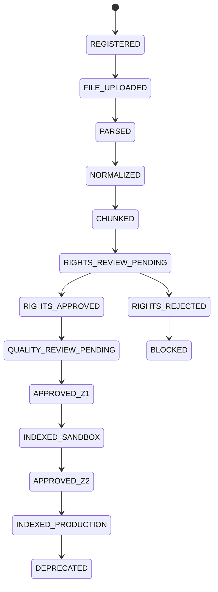

# 32 — State Machines

**Project:** Atman  **Version:** v0.2.1  **Status:** Canonical / Repo-generation-ready  **Date:** 2026-05-28  **Owner:** Atman Platform Architecture
## Purpose

This document upgrades Atman from execution-grade documentation to repo-generation-ready specification. It is binding for `ATMAN_REPO_v0_3` unless superseded by a later canonical version.

## Non-negotiable invariant

```text
Atman source authority comes from reviewed corpus + provenance + citations, not from external LLM memory or unverified scraped text.
```


## Scope

All object lifecycles must follow explicit state machines. Direct DB mutation outside these transitions is forbidden.

## Source lifecycle



## Artifact lifecycle

```text
DRAFT → VALIDATED → BENCHMARKED → RELEASE_CANDIDATE → APPROVED → ACTIVE → DEPRECATED → ARCHIVED
```

## Dataset sample lifecycle

```text
GENERATED_DRAFT
→ SOURCE_ALIGNED
→ REVIEW_PENDING
→ APPROVED_FOR_EVAL | APPROVED_FOR_TRAINING | REJECTED
→ VERSIONED
```

## Content lifecycle

```text
REQUESTED
→ GENERATED_DRAFT
→ CITATION_VERIFIED
→ SAFETY_VERIFIED
→ HUMAN_REVIEW_PENDING
→ APPROVED
→ PUBLISHED
→ RETRACTED
```

## Release gate lifecycle

```text
CREATED
→ EVAL_RUNNING
→ FAILED | PASSED_WITH_WARNINGS | PASSED
→ APPROVAL_PENDING
→ APPROVED | REJECTED
→ DEPLOYED
→ ROLLED_BACK
```

## Illegal transitions

| Object | From | To | Reason |
|---|---|---|---|
| Source | REGISTERED | APPROVED_Z2 | skips parse/review |
| Source | RIGHTS_REJECTED | INDEXED_PRODUCTION | rights block |
| Dataset | GENERATED_DRAFT | APPROVED_FOR_TRAINING | no source alignment |
| Release | FAILED | DEPLOYED | hard-fail active |
| Content | GENERATED_DRAFT | PUBLISHED | no verification |

## Enforcement

```text
1. Transitions happen through service layer only.
2. Each transition records actor, timestamp, reason, previous state, next state.
3. Blocked transitions return ATMAN_STATE_TRANSITION_BLOCKED.
4. State transitions must be tested in unit and integration tests.
```
